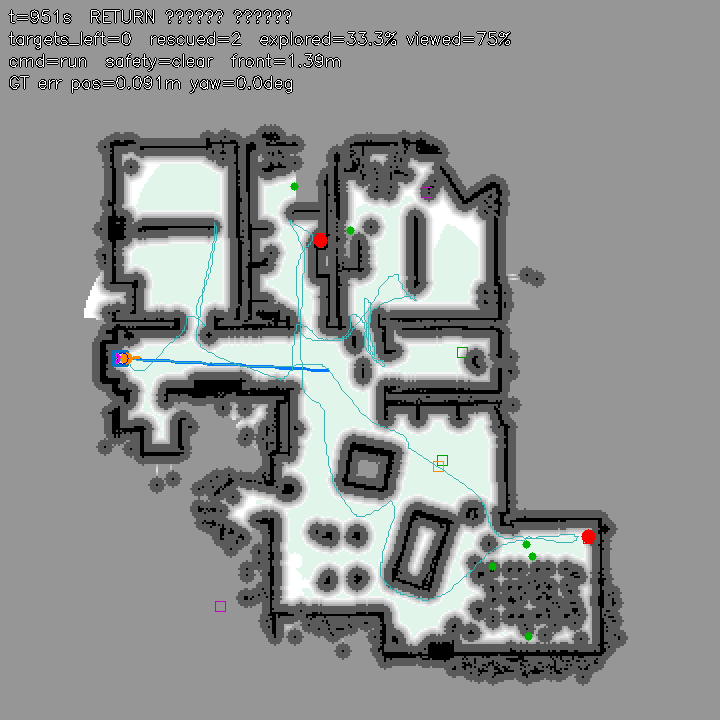

# PNU Robot Hackathon — 화재 현장 무인 구조 로봇 (TurtleBot3 자율 Search & Rescue)

2026 부산대학교 TECH WEEK Physical AI 해커톤 팀 제출물입니다.
Webots R2025a와 TurtleBot3 Burger로, **지도 없는 아파트를 LiDAR·엔코더로 탐색하며 지도를 만들고, 카메라로
요구조자 표식(빨간 사과 2개)을 찾아 접근한 뒤 시작점으로 복귀**하는 자율 구조 로봇입니다.
지휘관은 웹 콘솔에서 로봇을 감시·지휘하고, 주행 정책은 규칙 기반 계획기와 강화학습 정책을 함께 갖추고 있습니다.

| 구성 요소 | 위치 | 역할 |
|---|---|---|
| **자율 구조 컨트롤러** (제출 본체) | `controllers/tb3_mission/` | Bayesian 지도 작성, frontier·카메라 스윕 탐사, A*, Look-ahead 제어, Behavior Tree, 표식 탐지·접근·복귀 |
| **웹 지휘 콘솔** | `web/` | 지도·카메라·상공 시점·Behavior Tree 상태 표시, 출동 모드, 정지·복귀·수동 조종 |
| **강화학습 (PPO) 주행 정책** | `rl/`, `controllers/amr_controller/` | 무작위 시뮬레이션으로 학습한 Local Navigation 정책과 학습·평가 파이프라인 |
| 상공 추적 카메라 | `controllers/overhead_cam/` | 로봇 위 2.2 m를 따라다니는 Supervisor 카메라 (콘솔의 상공 시점) |
| 탐지 검사 리그 | `controllers/tb3_captest/` | 사과 앞 여러 거리·각도에서 카메라 탐지 성능 자동 측정 |
| 월드 | `worlds/apartment_mission.wbt` 등 | 원본 `apartment.wbt`에 컨트롤러 이름과 상공 카메라만 추가 |

세부 문서: [컨트롤러 README](controllers/tb3_mission/README.md) · [웹 콘솔 README](web/README.md) · [강화학습 README](rl/README.md)

---

## 1. 시나리오

아파트에 화재 경보가 울렸고 연기 때문에 소방관이 바로 진입할 수 없습니다.
무인 구조 로봇이 먼저 들어가 실내를 탐색하고 **요구조자 표식(빨간 사과 2개)** 을 찾아 위치를 확인한 뒤,
진입 지점(시작점)으로 돌아와 지휘관에게 보고합니다. 실내에는 대피 중인 거주자(보행자)가 있어 피해 다녀야 하고,
다른 색 표식(초록·보라는 접근 금지 구역, 주황은 위험물)에는 접근하지 않습니다.

지휘관은 웹 콘솔에서 **신속 구조**(가장 가까운 1명만 확인 후 복귀), **현 위치 대기**, **긴급 철수** 같은 출동 모드를
고르거나 로봇을 직접 조종할 수 있습니다. 콘솔 연결이 끊겨도 로봇은 제한 시간의 70 %가 지나면 스스로 복귀합니다.

---

## 2. 빠른 시작

### 요구 사항

| 항목 | 버전 |
|---|---|
| Webots | R2025a |
| Python | 3.10 (3.9 ~ 3.11) |
| 컨트롤러 라이브러리 | numpy, opencv-python, scipy. (선택) torch — 강화학습 정책 섀도 평가용 |
| 웹 콘솔 | 표준 라이브러리만 사용 |
| 강화학습 학습·평가 | torch, gymnasium, stable-baselines3 (`rl/README.md`) |

### 설치

```bash
git clone https://github.com/banchan01/pnu-robot-hackathon && cd pnu-robot-hackathon

# Python 3.10 가상환경 (uv 예시. venv/conda도 동일)
uv python install 3.10
uv venv --python 3.10 .venv
uv pip install --python .venv/bin/python numpy==1.23.5 opencv-python==4.8.0.74 scipy
uv pip install --python .venv/bin/python torch          # 선택: 강화학습 정책 섀도 평가

# Webots가 이 Python으로 컨트롤러를 실행하도록 설정
#   Webots 메뉴 Tools > Preferences > General > Python command 에 .venv/bin/python 절대 경로 입력
#   macOS는 아래 한 줄로도 가능
defaults write com.cyberbotics.Webots-R2025a General.pythonCommand -string "$(pwd)/.venv/bin/python"
```

Webots가 `apartment.wbt`를 처음 열 때 자원 다운로드가 멈추면, 자원 묶음을 캐시에 직접 풀어 넣으면 됩니다.

```bash
curl -L -C - -o /tmp/assets-R2025a.zip https://github.com/cyberbotics/webots/releases/download/R2025a/assets-R2025a.zip
mkdir -p ~/Library/Caches/Cyberbotics/Webots/assets          # Linux: ~/.cache/Cyberbotics/Webots/assets
unzip -oq /tmp/assets-R2025a.zip -d ~/Library/Caches/Cyberbotics/Webots/assets
```

### 실행

```bash
# 1) Webots에서 worlds/apartment_mission.wbt 를 열고 ▶ 실행  (로봇 컨트롤러: tb3_mission)
# 2) (선택) 웹 지휘 콘솔
.venv/bin/python web/server.py --port 8000     # 브라우저에서 http://127.0.0.1:8000/
```

- 로봇은 시작 즉시 자동 탐색을 시작합니다. 콘솔 창에 상태 로그가 찍히고 지도·카메라 창이 열립니다.
- 미션이 끝나면 `controllers/tb3_mission/output/`에 지도 이미지, 궤적, 요약 JSON, 검출 스냅샷이 저장됩니다.
- 목표 색·개수, 속도, 제한 시간 등은 `controllers/tb3_mission/mission.json`에서 바꿉니다.
- 심사용 원본 월드(`apartment.wbt`)를 쓰려면 `TurtleBot3Burger`의 `controller`를 `"tb3_mission"`으로만 바꾸면 됩니다.
  상공 카메라 노드가 없어도 컨트롤러와 콘솔은 정상 동작합니다.

헤드리스 자동 테스트: `cd controllers/tb3_mission && ./run_headless.sh ../../worlds/apartment_mission.wbt 600 /tmp/tb3.log`

---

## 3. 시스템 개요

```
                 ┌──────────────────────── controllers/tb3_mission ────────────────────────┐
 LiDAR ─────────▶│ 위치 추정(엔코더+자이로) ─▶ Scan-to-Map 보정 ─▶ Bayesian Occupancy Grid │
 엔코더·자이로 ─▶│        ─▶ Costmap ─▶ Frontier / 카메라 스윕 ─▶ A* ─▶ Look-ahead 제어    │─▶ 바퀴
 카메라 ────────▶│ HSV 색상 분할 사과 탐지 ─▶ 확정 ─▶ 접근                                 │
                 │        Behavior Tree 가 위 행동을 우선순위대로 선택                       │
                 │        PPO 정책(rl/)은 같은 관측으로 병렬 추론해 제안값을 기록 (섀도 모드) │
                 └────────────┬──────────────────────────────────────────────▲────────────┘
            output/status.json, live_map.png, live_cam.jpg          commands.txt, manual.json
                              ▼                                              │
                 ┌──────────── web/server.py ────────────┐        ┌── controllers/overhead_cam ──┐
                 │  지도·카메라·상공 시점·BT 상태 표시     │        │ 로봇 추적 천장 카메라 프레임 │
                 │  출동 모드 / 정지·복귀 / 수동 조종      │        └──────────────────────────────┘
                 └────────────────────────────────────────┘
```

**센서 정책**: 필수 LiDAR·휠 엔코더, 선택 IMU 자이로(방향), 카메라는 표식 탐지 전용, 나침반·GPS 미사용.
강의에서 다룬 인지 → 계획 → 행동 파이프라인이 전부 구현되어 있으며, 항목별 코드 위치는
[컨트롤러 README 2절](controllers/tb3_mission/README.md#2-시스템-구조)의 대응표에 있습니다.

**Behavior Tree** (우선순위 순)

```
Root (ReactiveSequence)
├─ SafetyGate: 수동 조종 → 외부 정지 → 끼임·막힘 복구 → 전방 안전
└─ Mission (ReactiveSelector)
    ├─ ForcedReturn  return 명령 또는 제한 시간 70 %
    ├─ Approach      목표 확정 시 접근 → 구조 기록
    ├─ Explore       frontier 탐사 → 도착 지점 360도 회전
    ├─ Sweep         카메라가 못 본 구역 방문 → 360도 회전
    ├─ ReturnHome    목표 완료 또는 탐사·스윕 소진
    └─ Idle
```

---

## 4. 강화학습 (PPO) 주행 정책

규칙 기반 계획기와 별도로, **무작위로 바뀌는 시뮬레이션을 수백만 스텝 돌리며 PPO 정책을 학습**했습니다.
학습 환경은 Webots 물리와 같은 차동 구동 운동학, LDS-01과 같은 36방향 LiDAR, 같은 아파트 배치(벽·가구 50개 상자)와
움직이는 보행자를 갖춘 초고속 2D 환경(`rl/`)이라 초당 수천 스텝을 돌릴 수 있습니다.

| 단계 | 환경 | 무작위화 (Domain Randomization) | 학습량 |
|---|---|---|---|
| 1. 장애물 회피 기초 | `rl/fast_env.py` 6 × 6 m 경기장 | 매 에피소드 상자·원기둥 장애물 5개 이상 무작위 배치, 로봇·목표 위치 랜덤 | 30만 스텝 |
| 2. 아파트 주행 | `rl/apartment_env.py` | 출발점·목표를 방과 사과 위치에서 무작위 선택(±15 cm 지터), 시작 방향 무작위, 보행자 궤적 구간과 진행도 무작위 | 300만 스텝 |
| 3. 실제 미션 | `rl/mission_env.py` | 출발 → 사과 A → 사과 B → 복귀의 3구간을 A* 웨이포인트로 안내, 에피소드가 임의 구간에서 시작 | 270만 스텝 (GPU 14개 병렬 환경, 13분 예산) |

- 관측 40차원: LiDAR 36구간 거리, 목표 거리·방위(sin, cos), 출발점 거리. 행동: 선속도·각속도.
- 보상: 목표 접근(+), 안전거리 유지, 보행자 근접·충돌(−), 도착(+). 학습 곡선과 평가 기록은 `rl/eval_logs/`에 있습니다.
- 학습된 정책은 `rl/amr_*_policy.pt`(SB3 MlpPolicy 가중치)로 저장되며 `controllers/amr_controller`가 Webots에서 직접 추론 주행합니다
  (`E` 키로 RL 정책 / 규칙 기반 회피 전환). 학습·평가 절차는 [rl/README.md](rl/README.md), GPU 학습은 `rl/WINDOWS_GPU.md`를 보십시오.

**제출 컨트롤러와의 관계.** 심사 미션은 반드시 완주해야 하므로 `tb3_mission`의 주행 명령은 검증된 규칙 기반 계획기가 냅니다.
대신 학습된 PPO 정책을 **같은 관측으로 매 tick 병렬 추론하는 섀도 모드**(`controllers/tb3_mission/rl_shadow.py`)로 실었습니다.
정책이 제안한 속도와 실제 명령의 일치도(회전 방향 일치율, 평균 속도 차)가 `output/summary_final.json`의 `rl_shadow` 항목에 기록되어,
정책을 Local Planner로 교체했을 때의 위험을 실제 미션 데이터로 평가할 수 있습니다. 교체 지점은 `Motion.follow`의
`(pose, path) → (v, w)` 인터페이스 하나이며, `mission.json`의 `rl_shadow`로 켜고 끕니다.

---

## 5. 실험 결과

`worlds/apartment_debug.wbt`(Supervisor로 실제 위치 기록)에서 실행한 결과입니다. 같은 코드는 결정론적으로 재현됩니다.

| 항목 | 결과 |
|---|---|
| 욕실 표식 확정 → 구조 | 8분 48초 → 8분 56초, 위치 오차 8 cm |
| 정원 표식 확정 → 구조 | 13분 18초 (3.9 m 거리에서 확정) → 13분 45초, 오차 6 cm |
| 시작점 복귀 · 미션 종료 | **15분 51초**, 복귀 오차 16 cm, 방향 오차 2.2° |
| 실제 위치 대비 추정 오차 | 최대 9.7 cm |
| 이동 거리 | 59.6 m |
| 금지 색 표식 | 검출은 기록, 접근 0회 |



빨간 원이 구조한 표식, 청록 선이 궤적, 연한 초록이 카메라가 훑은 구역입니다.

개발 과정에서 해결한 대표 문제:
- 바닥의 캔 위에서 바퀴가 미끄러지고 보행자에게 밀려 엔코더 오차가 3.7 m까지 누적 → **매 tick Scan-to-Map 보정(x, y, yaw)** 으로 10 cm 이내.
- 세면대 수납장 옆 틈의 표식은 남동쪽 2 m 이내에서만 보임 → **도착 지점 360도 회전 + 카메라 시야 지도 기반 스윕**.
- 얇은 수납장 문짝이 LiDAR 빔 사이로 빠져 끼임 → 점유 관측 가중치 상향, 좁은 통로 감속, 스캔 정지 기반 끼임 복구.

---

## 6. 창의성과 확장성 요약

- **사람과의 소통**: 웹 콘솔의 출동 모드·직접 지휘·수동 조종, 텍스트 파일 명령, 키보드 명령. 정지 명령은 Behavior Tree 최상위에서 처리되어 어떤 상태에서도 즉시 멈춥니다.
- **현실 변수 대응**: 문 닫힘·가구 전도(지도 실시간 갱신과 재계획), 거주자 통행(정지 대기 후 회피), 바닥 잔해(미끄러짐 보정), 통신 두절(자동 복귀), 구조 대상 변경(명령 한 줄).
- **학습 기반 확장**: 무작위 시뮬레이션에서 학습한 PPO 정책이 섀도 모드로 함께 돌아가며, 인터페이스 하나만 바꾸면 Local Planner를 학습 정책으로 교체할 수 있습니다. 환경이 바뀌면 `rl/`의 무작위화 범위를 넓혀 재학습하면 됩니다.
- **적용처**: 화재·지진 초기 탐색, 요양 시설 야간 응급 확인, 물류창고 재고 탐색. 모두 "지도 없는 실내에서 특정 대상을 찾아 보고"하는 같은 파이프라인입니다.
- **확장 지점**: 명령 채널이 텍스트 한 줄이라 음성·무전 문자를 붙일 수 있고, 상태 채널이 JSON이라 로봇 여러 대를 한 지휘소 화면에 모을 수 있습니다. 저장된 지도는 다음 출동의 초기 지도로 재사용됩니다.

자세한 내용은 [컨트롤러 README 7·8절](controllers/tb3_mission/README.md#7-창의성-사람과의-소통)과 [웹 콘솔 README](web/README.md)를 보십시오.

---

## 7. 저장소 구성

```
pnu-robot-hackathon/
├─ controllers/
│  ├─ tb3_mission/       자율 구조 컨트롤러 (제출 본체, README·docs/ 결과 포함)
│  ├─ amr_controller/    강화학습 정책 추론 주행 컨트롤러 (sensor_playground 월드)
│  ├─ mission_supervisor/ 장애물 무작위 재배치 Supervisor (도메인 랜덤화)
│  ├─ overhead_cam/      상공 추적 카메라 (Supervisor)
│  ├─ tb3_captest/       탐지 검사 리그 (Supervisor)
│  └─ tb3_teleop* 등     강사 제공 예제 (원본 그대로)
├─ rl/                   PPO 학습·평가 파이프라인, 학습된 정책, 평가 기록
├─ web/                  지휘 콘솔 (server.py, static/index.html, modes.json, README)
├─ worlds/
│  ├─ apartment.wbt            원본 심사 월드
│  ├─ apartment_mission.wbt    controller=tb3_mission + 상공 카메라
│  ├─ apartment_debug.wbt      위와 같되 Supervisor 켜짐 (ground truth 검증용)
│  ├─ apartment_captest.wbt    탐지 검사 리그용
│  ├─ sensor_playground.wbt    강화학습 정책 시험용 6 × 6 m 경기장
│  └─ breakroom_*.wbt          강사 제공 연습 월드
├─ docs/                 아키텍처 메모
└─ protos/, models/      원본 그대로 (YOLO 가중치는 git에 넣지 않음)
```
