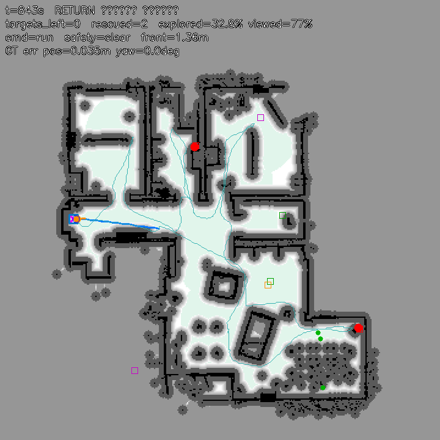

# tb3_mission — 화재 현장 무인 구조 로봇 (TurtleBot3 Burger 자율 Search & Rescue)

2026 부산대학교 TECH WEEK Physical AI 해커톤 제출물입니다.

**시나리오.** 아파트에 화재 경보가 울렸습니다. 소방관이 진입하기 전에 무인 구조 로봇이 먼저 들어가 실내를 탐색하고,
구조 요청 표식(빨간 사과 2개)을 찾아 위치를 확인한 뒤 현관(시작 지점)으로 복귀해 지휘관에게 보고합니다.
실내에는 대피 중인 거주자(보행자)가 있고, 로봇은 거주자와 가구를 피해 이동해야 합니다.
다른 색 표식(초록·보라·주황)은 이미 대피가 끝난 세대의 표식이므로 접근하면 안 됩니다.

로봇은 사전 지도와 자기 위치를 모르는 상태에서 **LiDAR와 휠 엔코더만으로 지도를 만들며 탐색**하고,
**카메라 색상 분할**로 표식을 찾습니다. 지휘관은 웹 콘솔(`web/`)에서 상태를 보고 정지·복귀·목표 변경 명령을 내릴 수 있습니다.

---

## 1. 실행 방법

### 1-1. 요구 사항

| 항목 | 버전 |
|---|---|
| Webots | R2025a |
| Python | 3.10 권장 (3.9 ~ 3.11) |
| 추가 라이브러리 | numpy, opencv-python, scipy |

### 1-2. 설치

```bash
# 1) 가상환경 (uv 예시. venv/conda도 동일)
uv python install 3.10
uv venv --python 3.10 .venv
uv pip install --python .venv/bin/python numpy==1.23.5 opencv-python==4.8.0.74 scipy

# 2) Webots가 이 Python으로 컨트롤러를 실행하도록 설정
#    Tools > Preferences > General > Python command 에 .venv/bin/python 절대 경로 입력
#    (macOS는 아래 한 줄로도 가능)
defaults write com.cyberbotics.Webots-R2025a General.pythonCommand -string "$(pwd)/.venv/bin/python"
```

Webots가 처음 `apartment.wbt`를 열 때 텍스처·메시 자원 다운로드가 중간에 멈추면 자원 묶음을 캐시에 직접 풀어 넣으면 됩니다.

```bash
curl -L -C - -o /tmp/assets-R2025a.zip https://github.com/cyberbotics/webots/releases/download/R2025a/assets-R2025a.zip
mkdir -p ~/Library/Caches/Cyberbotics/Webots/assets          # Linux: ~/.cache/Cyberbotics/Webots/assets
unzip -oq /tmp/assets-R2025a.zip -d ~/Library/Caches/Cyberbotics/Webots/assets
```

### 1-3. 실행

1. `controllers/tb3_mission/` 폴더를 프로젝트의 `controllers/` 아래에 둡니다.
2. `apartment.wbt`에서 `TurtleBot3Burger`의 `controller` 필드를 `"tb3_mission"`으로 바꿉니다
   (`worlds/apartment_mission.wbt`는 이미 바뀌어 있습니다).
3. 시뮬레이션을 시작하면 로봇이 자동으로 탐색합니다. 콘솔에 상태 로그가 찍히고 지도·카메라 창이 열립니다
   (창을 끄려면 `mission.json`의 `show_window`를 `false`).
4. 미션이 끝나면 `output/`에 지도 이미지, 궤적 CSV, 요약 JSON, 검출 스냅샷이 저장됩니다.
5. 웹 지휘 콘솔은 저장소 루트에서 `python web/server.py`로 띄웁니다 (`web/README.md` 참고).

**헤드리스 자동 테스트**: `./run_headless.sh ../../worlds/apartment_mission.wbt 600 /tmp/tb3.log`
(`worlds/apartment_debug.wbt`는 Supervisor가 켜져 있어 `TB3_DEBUG_GT=1`로 실제 위치 대비 오차를 함께 기록합니다.)

### 1-4. 설정 (`mission.json`)

| 키 | 의미 | 기본값 |
|---|---|---|
| `target_colors`, `target_count` | 목표 색과 개수 | `["red"]`, 2 |
| `forbidden_colors` | 접근 금지 색 | green, purple, orange |
| `time_limit_s`, `return_at_ratio` | 제한 시간, 강제 복귀 시점 비율 | 900, 0.7 |
| `v_max`, `w_max`, `lookahead_m` | 주행 속도와 Look-ahead 거리 | 0.18, 1.5, 0.35 |
| `stop_dist_m`, `slow_dist_m` | 전방 정지·감속 거리 | 0.25, 0.40 |
| `inflate_cells`, `soft_cells` | Costmap 팽창 반경(셀) | 4, 8 |
| `hsv` | 색상별 HSV 범위 | 파일 참고 |

---

## 2. 시스템 구조

```
센서 읽기 ─▶ 위치 추정 ─▶ Scan-to-Map 보정 ─▶ Bayesian 지도 갱신 ─▶ 표식 탐지 ─▶ 명령 수신 ─▶ Behavior Tree tick ─▶ 바퀴 속도
 (LiDAR, 엔코더,  localization.py   mapping.py         mapping.py        perception.py   commands.py    bt_mission.py       motion.py
  자이로, 카메라)
```

강의에서 다룬 항목과 코드의 대응입니다.

| 강의 항목 | 구현 | 파일 · 함수 |
|---|---|---|
| 휠 엔코더 odometry | 좌우 회전각 증분 → 이동 거리 → 방향 분해 적분 | `localization.py` `Localizer.update` |
| 방향 추정 (IMU 자이로) | 자이로 z축 각속도 적분 (시작 방향 = 0). 나침반·GPS는 사용하지 않음 | `localization.py` `Localizer.update` |
| **Scan Matching (Scan-to-Map)** | 매 tick 상관 매칭으로 위치 보정 (±6 cm, 1 cm 격자) | `mapping.py` `OccupancyGrid.match_scan` |
| LiDAR 360도 스캔 | 360빔, 0.12 ~ 3.5 m, 인덱스 180 = 전방 | `config.py` `LIDAR_ANGLES` |
| **Bayesian Occupancy Grid** | log-odds 갱신 `L ← L + l(z)`, 자유 −0.25 / 점유 +1.2, 클램프 ±3.5 | `mapping.py` `OccupancyGrid.update` |
| **Costmap** | 점유 254, 내접 253, 팽창 1~252, 미관측 255 | `mapping.py` `OccupancyGrid.costmap` |
| Frontier 탐사 | 자유 셀 중 미관측 인접 셀 → 연결 성분 → 크기/경로거리 점수 | `mapping.py` `OccupancyGrid.frontiers` |
| 카메라 시야 지도 · 스윕 | 카메라가 훑은 셀을 기록, 못 본 구역을 방문해 360도 회전 | `mapping.py` `mark_viewed`, `sweep_targets` |
| Global Planner | 8방향 A* + Costmap 비용 + 시선 단축 | `planner.py` `astar`, `simplify` |
| Local Planner | Look-ahead 곡률 제어 + 안전 계층(정지·감속·측면 보정) | `motion.py` `Motion.follow`, `apply_safety` |
| 끼임 판정 | 명령이 있는데 LiDAR 스캔이 정지해 있으면 끼임, 엔코더 적분 중단 | `motion.py` `ScanMotionMonitor` |
| RGBA → BGR 전처리 | `cv2.cvtColor(BGRA2BGR)` | `perception.py` `AppleDetector.detect` |
| HSV 색상 분할, 이진 마스크 | `inRange` + Opening/Closing | `perception.py` `_mask` |
| 컨투어, 최소 외접원, 무게중심 | 원형도·종횡비 필터, 외접원으로 거리 추정 | `perception.py` `detect` |
| 동적 환경 대응 | 지도 실시간 갱신, 경로 막힘 감지 시 재계획, 보행자 대기·회피 | `planner.py` `path_blocked`, `bt_mission.py` `front_clear` |
| **Behavior Tree** | Selector/Sequence/Parallel(노트북) + Reactive·Recovery 노드 | `bt_core.py`, `bt_mission.py` |

팀 센서 정책에 따라 **필수 센서는 LiDAR와 휠 엔코더**, 선택 센서로 **IMU 자이로**(방향)를 쓰고, 나침반과 GPS는 사용하지 않습니다.
카메라는 표식 탐지에만 씁니다. 방향 센서는 `mission.json`의 `heading_source`로 바꿀 수 있습니다 (`gyro` 기본, `encoder`, `compass`).

---

## 3. 인지 (Perception)

### 위치 추정
- 엔코더: `d = R·Δφ`, `Δs = (d_r + d_l)/2`, `x += Δs·cos θ`, `y += Δs·sin θ`
- 방향: IMU 자이로 z축 각속도를 매 tick 적분합니다 (`θ += ω_z·Δt`). Supervisor ground truth 대비 방향 오차는 15분 주행 후에도 1도 안팎입니다.
- **Scan-to-Map Matching**: 지도의 확신 있는 점유 셀까지의 거리 변환 위에 현재 스캔의 반사점을 얹어,
  ±6 cm 범위를 1 cm 간격으로 탐색해 가장 잘 맞는 평행 이동을 찾고 0.7배를 적용합니다 (매 tick, 약 1 ms).
  바닥의 캔 위에서 바퀴가 미끄러지거나 보행자에게 밀리는 상황에서 엔코더 오차가 3 m 이상 누적되던 것을
  **10 cm 이내**로 억제했습니다.
- **헛돔 판정**: 0.4초 동안 LiDAR 스캔 변화량(중앙값)이 8 mm 미만인데 이동 명령이 있으면 바퀴가 헛도는 것으로 보고
  엔코더 증분을 버립니다. 2.5초 이상 지속되면 끼임으로 판정해 복구 행동으로 넘깁니다.

### Bayesian Occupancy Grid
- 18 × 18 m, 5 cm 해상도 (360 × 360 셀). 시작 지점이 원점.
- 매 스캔마다 360개 빔을 2.5 cm 간격으로 샘플링하여 자유 셀에 `−l_free`, 반사 지점 셀에 `+l_occ`를 더합니다.
- 점유 가중치를 자유보다 크게 두어(1.2 대 0.25) 빔 사이로 빠지기 쉬운 의자·탁자 다리가 지워지지 않게 했습니다.
- 각속도가 1 rad/s를 넘는 tick은 빔이 번지므로 갱신을 건너뜁니다. 보행자가 지나간 자리는 이후 자유 관측으로 지워집니다.

### 표식(사과) 탐지
1. BGRA → BGR → 가우시안 블러 → HSV
2. 색상 범위 마스크 (빨강은 Hue 0 부근 두 구간을 OR), Opening 1회, Closing 2회
3. 외곽 컨투어 → 면적 ≥ 50 px, 원형도 ≥ 0.55, 종횡비 0.6 ~ 1.7
4. **바닥 기하 일관성 검사**: 바닥 위 사과는 거리 `d`에서 화면 세로 위치가 `cy = 240 + f·(h_cam − r_apple)/d` 근처에만
   나타납니다. 30 px 이상 벗어나면 탁자 위 과일, 벽의 그림, 크기가 다른 붉은 물체로 보고 기각합니다.
5. 최소 외접원 반지름으로 거리 `d = f·(2r_apple)/(2r_px)`, 방위 `−atan((cx − 320)/f)` → 로봇 pose로 지도 좌표 변환
6. 최근 7프레임 중 5프레임 이상 같은 위치(0.35 m)면 **확정**. 금지 색은 기록만 하고 절대 확정하지 않습니다.

탐지 검사 리그(`controllers/tb3_captest`, `worlds/apartment_captest.wbt`)로 사과 앞 0.5 ~ 3 m에서 거리 추정을 검증했습니다.
거리 오차는 3 m에서 10 % 이내였고, 욕실 표식은 세면대 수납장에 가려져 남동쪽 2 m 이내에서만 보인다는 사실을 확인했습니다.

---

## 4. 계획 (Planning)

- **Costmap**: 점유 셀을 4셀(20 cm) 팽창하여 내접 구역으로, 그 밖 8셀까지 비용 경사를 둡니다.
- **Frontier 선택**: 팽창 구역 밖 자유 셀 중 미관측 셀에 인접한 것을 연결 성분으로 묶고, 크기 ÷ (BFS 경로 거리 + 1)이 큰 후보를 고릅니다.
  반복 실패한 후보는 60초 블랙리스트. frontier가 15초 이상 없으면 소진으로 보되 지도 갱신으로 다시 생기면 탐사를 재개합니다.
- **카메라 스윕**: frontier가 소진됐는데 목표가 남아 있으면, 카메라가 2 m 이내에서 훑지 못한 비점유 셀 덩어리를
  가까운 순으로 방문해 제자리 360도 회전합니다. 벽 옆 틈도 후보에 포함됩니다.
- **A\***: 8방향, 대각선 모서리 끼임 방지, 미관측 셀은 탐색 목표로 갈 때만 비용 3배로 허용, 복귀 시에는 금지.
  로봇이 서 있는 자리 주변은 계획 시 통행 가능으로 비웁니다.
- **재계획 조건**: 목표 변경, 앞 1.5 m 경로가 새 점유 셀에 막힘, 전방 장애물 5초 지속, 끼임 복구 후, 20초간 진전 없음.

---

## 5. 행동 (Action)

- **Look-ahead 제어**: 현재 인덱스 이후에서 로봇과의 거리가 0.35 m 이상이 되는 첫 waypoint를 목표점으로,
  곡률 `κ = 2y/(x²+y²)`, `ω = v·κ`, `v_r = v + ωL/2`, `v_l = v − ωL/2`. 방향 오차가 60도를 넘으면 제자리 회전.
- **안전 계층**: 전방 ±30도 최소 거리 0.40 m 이하 감속, 0.25 m 이하 정지. 정지는 전진에만 적용되어 후진·회전은 항상 가능합니다.
- **보행자 대응**: 전진이 5초 이상 막히면 더 비어 있는 쪽으로 후진·회전 후 재계획합니다.
- **끼임 복구**: 후진 2초 → 회전 1.2초 → 재계획. 끼인 지점 앞에는 LiDAR에 안 보이는 낮은 장애물로 보고 가상 장애물을 남깁니다.
- **도착 지점 회전**: frontier에 도착할 때마다 360도 회전해 카메라로 주변을 훑습니다.
- **접근**: 표식 앞 0.35 m 지점을 A*로 가고, 시각 서보로 화면 중앙 정렬 후 0.25 m까지 접근합니다.
  벽에 붙은 표식처럼 더 못 다가가면 0.6 m 이내에서 정면으로 보일 때 도착으로 처리합니다.
- **복귀**: 원점으로 A* → 도착 → 시작 방향으로 정렬 → 보고서 저장.

---

## 6. Behavior Tree

```
Root (ReactiveSequence)
├─ SafetyGate (ReactiveSequence)           매 tick 재평가 → Mission보다 항상 우선
│   ├─ ManualOverride                      웹 콘솔 수동 조종이면 (v, w) 직접 적용
│   ├─ NotExternallyStopped                외부 정지 명령이면 정지 유지
│   ├─ StuckRecovery (Recovery)            끼임·전방 막힘 지속 → Escape(후진·회전) → 재계획
│   └─ FrontClear                          전진이 막힌 시간을 재서 5초 넘으면 회피 요청
└─ Mission (ReactiveSelector)              우선순위: 강제복귀 > 접근 > 탐색 > 스윕 > 복귀 > 대기
    ├─ ForcedReturn (Sequence)  [return 명령 또는 제한시간 70%] → PlanHome → FollowPath → Align → Finish
    ├─ Approach     (Sequence)  [목표 확정] → ProtectTarget → PlanToStandoff → FollowPath → VisualApproach → MarkRescued
    ├─ Explore      (Sequence)  [남은 목표 > 0] → SelectFrontier → PlanToGoal → FollowPath → Rotate360
    ├─ Sweep        (Sequence)  [frontier 소진, 목표 남음] → SelectSweepGoal → PlanToGoal → FollowPath → Rotate360
    ├─ ReturnHome   (Sequence)  [목표 없음 또는 탐사·스윕 모두 20초 이상 소진] → PlanHome → FollowPath → Align → Finish
    └─ Idle
```

- `bt_core.py`: 노트북의 `Status`, `Node`, `Selector`, `Sequence`, `Parallel`, `Blackboard`, `BehaviorTree`에
  `ReactiveSequence`, `ReactiveSelector`, `Recovery`, `Condition`, `Action`, `Inverter`를 추가했습니다.
- 모든 잎 노드는 `Blackboard`만 읽고 씁니다 (`pose`, `costmap`, `path`, `goal`, `detection`, `targets_left`, `command_state` …).
- 우선순위가 높은 서브트리가 살아나면 낮은 서브트리는 자동으로 `reset`됩니다. 이 때문에 **여러 노드가 공유하는 상태는
  reset에 지워지므로**, 누적 회전각 같은 상태는 `Rotate360` 클래스처럼 노드 객체 안에 둡니다.

---

## 7. 창의성: 사람과의 소통

지휘관과 로봇의 소통 채널입니다.

| 채널 | 명령 | 동작 |
|---|---|---|
| 웹 지휘 콘솔 (`web/`) | 출동 모드, 정지·재개·즉시 복귀, 표식 색·인원 변경, 수동 조종, 자유 텍스트 | 실시간 지도·카메라·Behavior Tree 상태 표시 |
| 텍스트 파일 `commands.txt` | `stop` / `resume` / `return` / `target <색> <개수>` / `status` | 한 줄 쓰면 즉시 반영 |
| 키보드 (3D 뷰 클릭 후) | `P` 정지, `R` 재개, `H` 즉시 복귀, `S` 상태 출력 | 동일 |

- 정지 명령은 Behavior Tree의 SafetyGate에서 처리되어 어떤 상태에서도 즉시 멈춥니다.
- 거주자(보행자)를 만나면 정지하고 지나가기를 기다리며, 만난 횟수와 최소 거리를 보고서에 기록합니다.
- 미션 종료 시 `output/summary_final.json`에 구조 위치, 탐색률, 이동 거리, 복귀 오차, 이벤트 로그를 남깁니다.

---

## 8. 확장성

**화재 상황의 변수와 대응**

| 상황 | 대응 | 상태 |
|---|---|---|
| 연기·조명 변화로 카메라 무력화 | LiDAR 지도와 탐사는 카메라와 독립이라 계속 동작. 표식 탐지만 중단되고 스윕이 반복됨 | 구조상 지원 |
| 문이 닫히거나 가구가 쓰러져 경로가 막힘 | Bayesian 지도가 실시간 갱신되고 경로 막힘 감지 시 재계획 | 구현·검증 |
| 거주자가 통로를 막음 | 정지 대기 후 회피 기동, 반복 시 목표 변경 | 구현·검증 |
| 바닥의 잔해로 바퀴 미끄러짐 | 스캔 정지 판정 + Scan-to-Map 보정 | 구현·검증 |
| 배터리 부족 | 제한 시간 70 % 지점 강제 복귀 (배터리 모델로 교체 가능) | 구현 |
| 구조 대상이 바뀜 | `target` 명령 또는 `mission.json`으로 색·개수 변경 | 구현 |

**현실 적용처**: 화재·지진 현장 초기 탐색, 병원·요양 시설 야간 순찰과 응급 호출 확인, 물류창고 재고 위치 탐색.
모두 "지도 없는 실내를 탐색해 특정 대상을 찾고 보고한다"는 같은 파이프라인입니다.

**설계상 확장 지점**
- Local Planner(`Motion.follow`)는 `(pose, path) → 바퀴 속도` 인터페이스라 학습 기반 회피 정책으로 교체할 수 있습니다.
- 지도는 `output/logodds_final.npy`로 저장되어 다음 출동의 초기 지도로 재사용할 수 있습니다.
- Blackboard와 잎 노드 구조 덕분에 배터리 모델, 다중 로봇 영역 분담 노드를 추가해도 기존 노드를 고칠 필요가 없습니다.

---

## 9. 실험 결과

`worlds/apartment_debug.wbt`(Supervisor로 실제 위치 기록)에서 헤드리스 fast 모드로 실행한 결과입니다.
아래 표는 17번째 실행(`docs/summary_run17.json`)이고, 최종 코드의 20번째 실행(`docs/summary_run20.json`, `docs/result_map_run20.png`)은
욕실 표식 8분 56초, 정원 표식 13분 45초, 복귀 15분 51초(복귀 오차 16 cm, 최대 위치 오차 9.7 cm)로 완주했습니다.

| 항목 | 결과 |
|---|---|
| 표식 1 (욕실 틈) 확정 · 구조 | 281 s, 추정 위치 오차 8 cm |
| 표식 2 (정원) 확정 · 구조 | 664 s에 3.16 m 거리에서 확정, 688 s 구조, 오차 6 cm |
| 시작점 복귀 | 842 s, 복귀 오차 0.17 m, 방향 오차 2.7° |
| 실제 위치 대비 추정 오차 | 최대 9.7 cm, 최종 3.5 cm |
| 이동 거리 · 탐색률 | 55 m · 32.8 % (18 × 18 m 격자 기준, 아파트 전체) |
| 금지 색 표식 검출 | 1688회 기록, 접근 0회 |
| 끼임 · 전방 막힘 | 0회 · 10회 (모두 자동 회피) |



빨간 원이 구조한 표식, 청록 선이 궤적, 연한 초록이 카메라가 훑은 구역입니다.
검출 스냅샷: `docs/detect_bathroom_apple.png`, `docs/detect_garden_apple.png`

**개발 중 해결한 문제**
- 바닥의 캔 위에서 바퀴가 미끄러져 엔코더 오차가 3.7 m까지 누적 → 매 tick Scan-to-Map 보정으로 10 cm 이내.
- 벽 옆 틈의 표식을 LiDAR 탐사만으로는 지나침 → 도착 지점 360도 회전과 카메라 시야 지도 기반 스윕.
- 접힌 경로에서 제자리 회전이 반복됨 → 유클리드 Look-ahead와 20초 진전 감시.

---

## 10. 한계와 알려진 문제

- 표식은 LiDAR 높이(17 cm) 아래에 있어 LiDAR로 보이지 않으므로, 접근 단계는 카메라에만 의존합니다.
- 탁자·침대처럼 LiDAR 높이 위에 걸쳐 있는 장애물은 지도에 다리만 기록되며, 충돌 시 끼임 복구로 대응합니다.
- 탐사 순서는 frontier 점수에 따라 달라져 완주 시간이 실행마다 수 분 차이가 납니다.
- 연기·조명 변화 같은 카메라 무력화 상황은 시뮬레이션에서 다루지 않았습니다.

---

## 파일 구성

```
tb3_mission/
├─ tb3_mission.py   진입점, 메인 루프
├─ config.py        상수, mission.json 로더
├─ mission.json     조정값
├─ localization.py  엔코더 + 자이로 위치 추정, 스캔 매칭 보정 적용
├─ mapping.py       Bayesian Occupancy Grid, Costmap, Frontier, 카메라 시야 지도, Scan-to-Map 매칭
├─ planner.py       A*, 경로 단축, 막힘 감지
├─ motion.py        Look-ahead 제어, 안전 계층, 시각 서보, 스캔 기반 끼임 판정
├─ perception.py    HSV 색상 분할 표식 탐지
├─ bt_core.py       Behavior Tree 노드
├─ bt_mission.py    미션 잎 노드와 트리 조립
├─ commands.py      외부 명령 수신
├─ bridge.py        웹 콘솔용 상태 내보내기
├─ report.py        디버그 화면, 결과 저장
├─ run_headless.sh  자동 테스트 스크립트
└─ docs/            결과 지도, 검출 스냅샷, 요약 JSON
```
